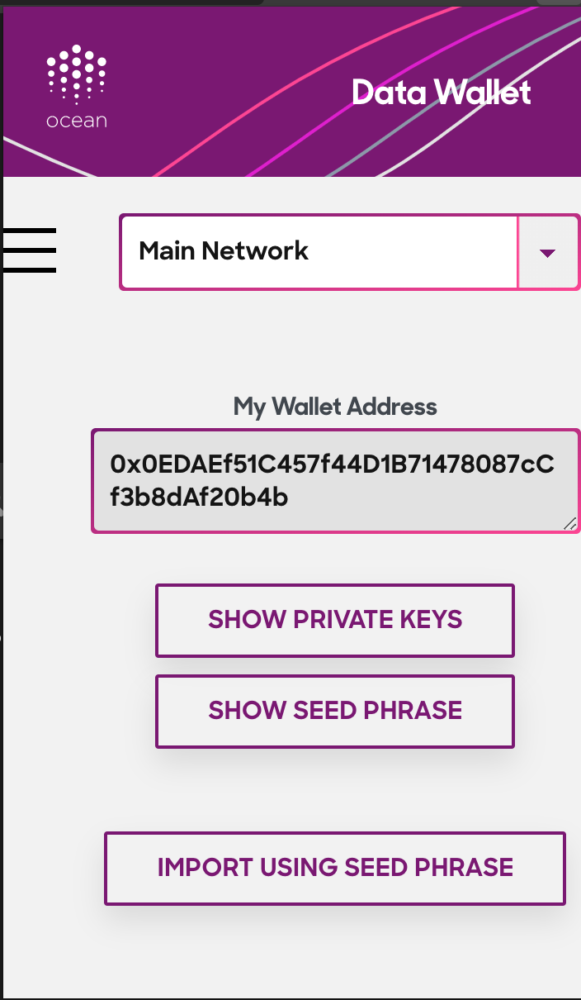
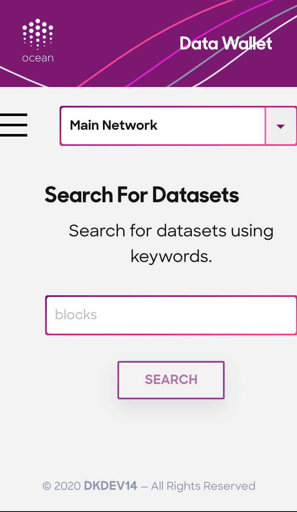
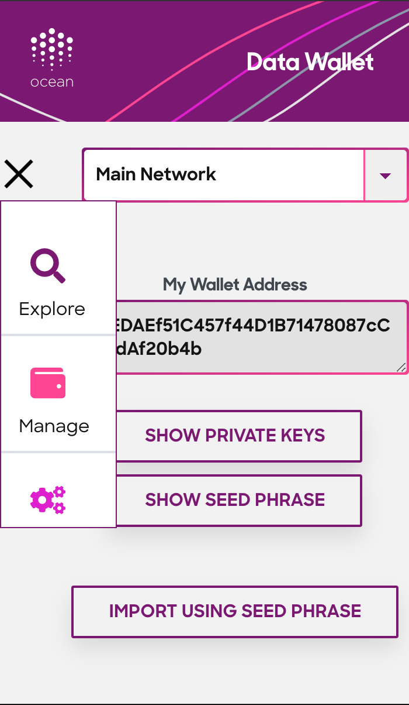

# Data Wallet

#### Cross browser extension to search and manage data assets using Ocean Protocol

## screenshots







## Development

```bash
# Install dependencies
npm i

# Start development server on browser
npm start
```

## Build Firefox extension

1. `npm run firefox`
1. After that, follow [these guidelines](https://extensionworkshop.com/documentation/develop/temporary-installation-in-firefox/).
   > **Note** - If you get errors while loading extension through browser, try `web-ext` tool. You will run this script in the `build/` folder

## Build Chrome extension

1. `npm run chrome`
1. load `build/` folder into Chrome extensions (chrome://extensions) page. Here's a small video demo'ing how to do it - [Load Unpacked Browser Extension](https://www.youtube.com/watch?v=oswjtLwCUqg)

## Build Brave Browser extension

1. `npm run brave`
1. load `build/` folder into Brave extensions (brave://extensions) page. Here's a small video demo'ing how to do it - [Load Unpacked Browser Extension](https://www.youtube.com/watch?v=oswjtLwCUqg)
